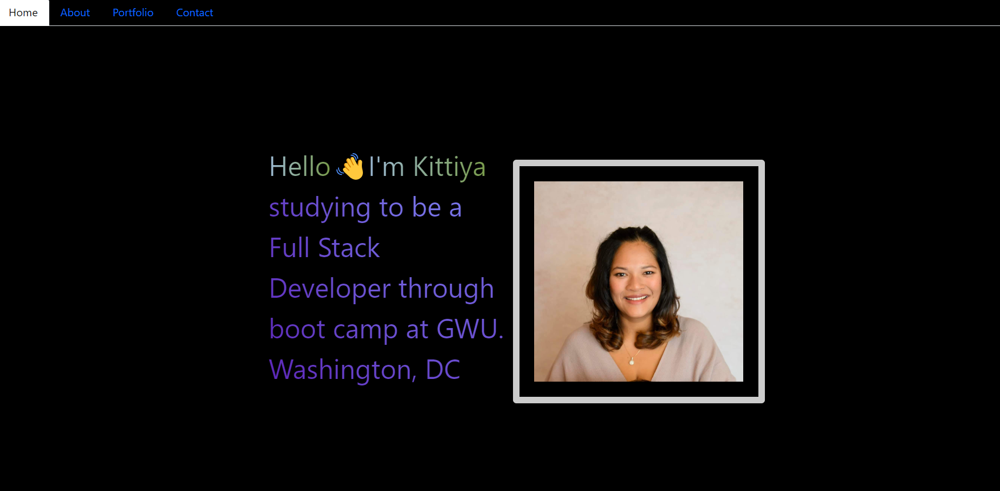

# React-Portfolio
This is my portfolio website built with React.js.

## Technologies Used
- React.js
- CSS
- HTML

## How to run
- Clone the repository to your local machine  Link to repository: [git@github.com:KittiyaLooknam/React-Portfolio.git](https://github.com/KittiyaLooknam/React-Portfolio.git)

- Run `npm install`

- Run `npm start`

## Screenshot

